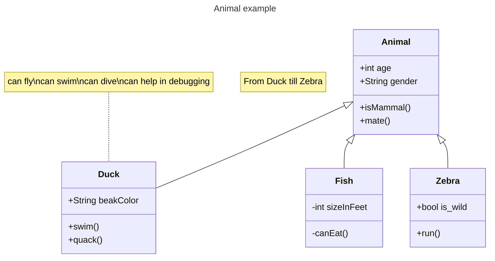

# TowerDefenseTemplate

Begin met een korte omschrijving van je towerdefense game en hoe deze werkt. Plaats ook een paar screenshots.

## Product 1: "DRY SRP Scripts op GitHub"
ik denk dat dit script voldoet aan SRP omdat dit het maar 1 doel heeft en 1 ding doet.
(C:\Users\bakme\Tower Defensee\Assets\Scripts.cs)
ik denk dat dit script voldoet aan de DRY script omdat het meerdere functies heeft.
(C:\Users\bakme\Tower Defensee\Assets\Scripts.cs)

## Product 2: "Projectmappen op GitHub"

Je commit de mappenstructuur van je unity project op github en verwijst vanuit je readme naar de root map van je project. Met een netjes en goed gestructureerde mappenstructuur en benamingen van files toon je aan dat je dit leerdoel beheerst. 

Dit is de [ROOT](/MyTowerDefenseGame/) folder van mijn unity project.

Zorg dat deze verwijst naar je Develop branch.

## Product 3: Build op Github

Je maakt in Unity een stabiele “build” van je game waarbij bugs en logs eerst zijn verwijderd. Deze buildfiles upload je in je repository onder releases.  Bij eventuele afwijkingen moeten deze worden gedocumenteerd in de release. (Bijv controller nodig of spelen via netwerk etc..) 

[Release Voorbeeld](https://github.com/erwinhenraat/TowerDefenseTemplate/releases)

## Product 4: Game met Sprites(animations) en Textures 

De build van je game bevat textures, sprites en sprite animations(bijv particles) die op de juiste manier zijn gebruikt en zorgen voor een goede afwerking van je game.  

Plaats in je readme een animated gif van je gameplay (+- 10 sec.) waarin de implementatie van je textures en sprites goed te zien is.

## Product 5: Issues met debug screenshots op GitHub 

Zodra je bugs tegenkomt maak je een issue aan op github. In de issue omschrijf je het probleem en je gaat proberen via breakpoints te achterhalen wat het probleem is. Je maakt screenshot(s) van het debuggen op het moment dat je via de debugger console ziet wat er mis is. Deze screenshots met daarbij uitleg over het probleem en de bijhorende oplossing post je in het bijhorende github issue. 
[Hier de link naar mijn issues](https://github.com/erwinhenraat/TowerDefenseTemplate/issues/)

## Product 6: Game design met onderbouwing 

*  **Je game bevat torens die kunnen mikken en schieten op een bewegend doel.** 
Mijn torens kunnen richten en schieten op de enemies. ik heb hiervoor gekozen zodat de enemies dood gemaakt kunnen worden

*  **Je game bevat vernietigbare vijanden die 1 of meerderen paden kunnen volgen.**  

mijn kunnen vernietiged worden.

*  **Je game bevat een “wave” systeem waarmee er onder bepaalde voorwaarden (tijd/vijanden op) nieuwe waves met vijanden het veld in komen.**

na elke wave worden de enemies ietjes sterker.

*  **Een “health” systeem waarmee je levens kunt verliezen als vijanden hun doel bereiken en zodoende het spel kunt verliezen.** 

de health system moet ik nog doen, ik wil dat in de vorm van een basis is.

*  **Een “resource” systeem waarmee je resources kunt verdienen waarmee je torens kunt kopen en .evt upgraden.**

ik heb een money system, dus elke keer wanneer je een enemy killed krijg je meer geld om betere of meerdere torens te kopen.

*  **Een “upgrade” systeem om je torens te verbeteren.**

ik heb geen upgrade system maar wel een tweede toren

*  **Een “movement prediction” systeem waarmee je kan berekenen waar een toren heen moeten schieten om een bewegend object te kunnen raken. (Moeilijk)**

deze heb ik ook niet de toren schiet gewoon.

## Product 7: Class Diagram voor volledige codebase 

Je brengt je volledige codebase in kaart met behulp van een class diagram. Binnen de classes hoeven geen private members te worden weergegeven. Wel alle public members (fields en methods). Ook geef je indien relevant de relaties tussen je classes weer. Je class diagram plaats je in je readme op github. Evt mag je dit doen m.b.v de [“Mermaid”](https://mermaid.js.org/syntax/classDiagram.html) tool.

## Product 8: Prototype test video
Je hebt een werkend prototype gemaakt om een idee te testen. Omschrijf if je readme wat het idee van de mechanics is geweest wat je wilde testen en laat een korte video van de gameplay test zien. 

## Product 9: SCRUM planning inschatting 

dit is mijn trello board
(https://trello.com/b/GQnRTH0R/tower-d)

## Product 10: Gitflow conventions

Je hebt voor je eigen project in je readme gitflow conventies opgesteld en je hier ook aantoonbaar aan gehouden. 

De gitflow conventions gaan uit van een extra branch Develop naast de "Master"/"Main". Op de main worden alleen stabiele releases gezet.

Verder worden features op een daarvoor bedoelde feature banch ontwikkeld. Ook kun je gebruik maken van een hotfix brancg vanaf develop.

Leg hier uit welke branches jij gaat gebruiken en wat voor namen je hier aan gaat meegeven. Hoe vaak ga je comitten en wat voor commit messages wil je geven?

Meer info over het gebruiken van gitflow [hier](https://www.atlassian.com/git/tutorials/comparing-workflows/gitflow-workflow)
